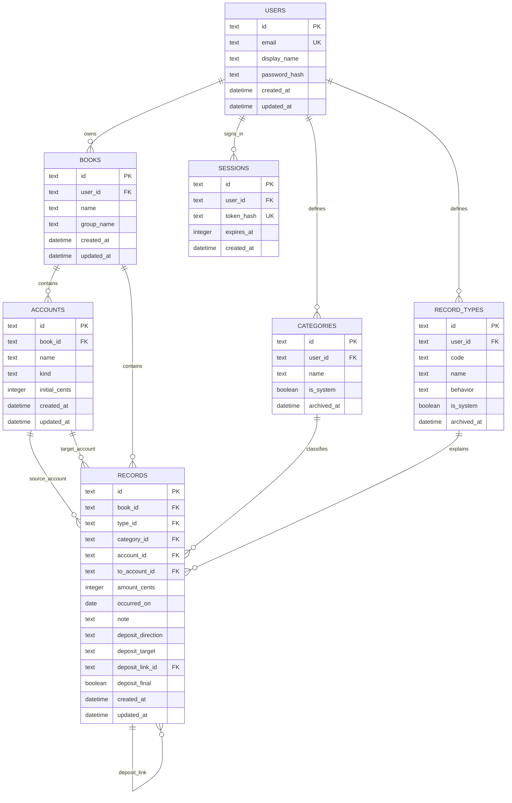

# 后端与数据库第一版设计

## 目标

把当前保存在单个浏览器 `localStorage` 中的数据迁移到 FastAPI 和 SQLite，同时保留现有记账规则、JSON 备份能力和以后增加登录权限的空间。

第一版后端先在本机运行，前端采用渐进接入：先读取账本、账户、选项、账目和总览，失败时回退到本地数据；等接口、迁移和对账都验证完成后，再切换写入来源。

## 设计原则

- 金额在数据库和接口中只使用整数分，例如 12.34 元保存为 `1234`。
- 日期使用 `YYYY-MM-DD`，创建和更新时间使用 UTC 时间。
- 数据库主键使用 UUID 字符串，导入旧数据时建立旧 ID 到新 ID 的映射。
- 账本是账户和账目的数据边界；所有查询必须先确定所属账本。
- 类别和记账类型属于用户级选项，可以被多个账本使用。
- 自定义类别或类型停止使用时采用归档，历史账目继续保留原来的统计含义。
- 删除账户后，历史账目保留，账户引用设为空，与当前“未指定账户”的显示方式一致。
- 数据迁移、批量导入和备份恢复必须使用数据库事务，失败时整体回滚。
- localStorage 迁移先离线转换成服务端备份格式，再交给统一导入服务；转换器不直接连接数据库，避免读取或修改真实数据。

## 数据关系



## 表和约束

### users

阶段 3 先创建一个本地开发用户，所有迁入数据归属于该用户。schema v5 已增加密码哈希和会话表；真正登录后请求依赖按会话确定用户，迁移期间没有 Cookie 的请求仍可使用固定开发用户回退。

- `email` 唯一。
- 删除用户时级联删除该用户的数据。
- `password_hash` 保存 PBKDF2 哈希字符串，不保存明文密码。

### sessions

- `token_hash` 只保存会话令牌的 SHA-256 摘要，原始令牌只通过 HttpOnly Cookie 返回一次。
- `expires_at` 使用 Unix 秒数；读取会话时清理过期记录。
- `user_id` 外键级联删除，用户删除后不会留下可用会话。

### books

- `user_id` 指向用户。
- `group_name` 对应当前账本的分类标签，避免与账目类别混淆。
- 同一用户下账本名称可以重复，但接口返回重复名称提示。
- 删除账本时级联删除该账本的账户和账目。

### accounts

- `book_id` 指向账本。
- `kind` 只能是 `asset` 或 `liability`，分别对应资金和负债。
- `initial_cents` 必须是大于等于 0 的整数。
- 删除账户时，账目中的 `account_id` 和 `to_account_id` 使用 `SET NULL`。

### categories

- 内置类别和用户自定义类别使用同一张表，通过 `is_system` 区分。
- 用户删除自定义类别时写入 `archived_at`，新账目不再显示该选项，旧账目仍能显示原类别。
- 同一用户的未归档类别名称不能重复。

### record_types

`behavior` 描述业务行为，而不是只保存显示名称：

- `income`：收入并流入账户。
- `expense`：支出并流出账户。
- `expense_reversal`：退款或报销，冲减支出并流入账户。
- `transfer`：账户之间转账。
- `outflow_neutral`：代付等只产生资金流、不直接计入支出。
- `neutral`：余额、借贷等当前中性记录。
- `deposit`：押金，由方向和最终结算决定统计结果。

自定义类型的“算收入、算支出、中性”分别映射到 `income`、`expense`、`neutral`。类型归档后保留历史记录的原统计含义。

### records

- `amount_cents` 必须是大于 0 的整数。
- `occurred_on` 必须是合法本地日期。
- 普通资金流需要 `account_id`。
- 转账需要 `account_id` 和 `to_account_id`，两个账户不能相同且必须属于同一账本。
- 押金方向只允许 `receive`、`return_to_other`、`pay`、`returned_to_me`。
- 退回押金需要 `deposit_link_id`，关联记录必须属于同一账本并且是方向匹配的原押金。
- 只有标记 `deposit_final` 的退回记录才计算最终差额。
- SQLite 难以表达的跨行和跨表规则由服务层校验，数据库继续负责外键、非空、唯一和数值范围约束。

## 第一版 REST API

所有接口统一使用 `/api` 前缀，金额字段统一为 `amount_cents` 或 `initial_cents`。

| 方法 | 路径 | 作用 |
|---|---|---|
| GET | `/api/health` | 检查后端和数据库是否可用 |
| POST | `/api/auth/register` | 注册并建立登录会话 |
| POST | `/api/auth/login` | 校验密码并建立登录会话 |
| POST | `/api/auth/logout` | 撤销当前会话并清除 Cookie |
| GET | `/api/auth/me` | 返回当前登录用户 |
| GET / POST | `/api/books` | 查询、新建账本 |
| GET / PATCH / DELETE | `/api/books/{book_id}` | 查询、修改、删除单个账本 |
| GET / POST | `/api/books/{book_id}/accounts` | 查询、新建账本账户 |
| PATCH / DELETE | `/api/books/{book_id}/accounts/{account_id}` | 修改、删除账户 |
| GET / POST | `/api/books/{book_id}/records` | 筛选或新增账目 |
| GET / PATCH / DELETE | `/api/books/{book_id}/records/{record_id}` | 查询、修改、删除账目 |
| GET / POST | `/api/categories` | 查询、新建类别 |
| PATCH / DELETE | `/api/categories/{category_id}` | 修改或归档类别 |
| GET / POST | `/api/record-types` | 查询、新建记账类型 |
| PATCH / DELETE | `/api/record-types/{type_id}` | 修改或归档类型 |
| GET | `/api/overview` | 返回所有账本的收支和净资产汇总 |
| GET | `/api/backups/export` | 导出服务端 JSON 备份 |
| POST | `/api/backups/import` | 校验并事务式导入备份 |
| POST | `/api/backups/preview` | 只读校验服务端备份并返回对账摘要 |
| POST | `/api/backups/preview-local` | 转换网页备份、只读校验并返回对账摘要 |
| POST | `/api/backups/import-local` | 用户确认后转换并事务式导入网页备份 |

账目查询支持 `from`、`to`、`account_id`、`category_id` 和 `q` 参数，对应现在的日期、账户、类别和关键字筛选。

## 返回和错误约定

- 新建成功返回 `201`，查询和修改成功返回 `200`，删除成功返回 `204`。
- 请求字段不合法返回 FastAPI 的 `422`。
- 资源不存在或不属于当前用户返回 `404`，避免泄露其他用户是否拥有该资源。
- 重名或状态冲突返回 `409`。
- 错误体统一包含稳定的 `code` 和用户可读的 `message`。
- 列表接口统一返回 `items`，以后可以增加 `total`、`limit` 和 `offset`。

## 从 localStorage 迁移到 SQLite

1. 用户先导出并保留一份现有 JSON 备份。
2. 网页调用只读预览接口，先查看数量、收支和净资产对账，不写入正式数据库。
3. 后端在一个数据库事务中创建本地开发用户。
4. 导入账本，建立旧账本 ID 到新 UUID 的映射。
5. 导入并去重类别、内置类型和自定义类型。
6. 按账本导入账户，建立旧账户 ID 到新 UUID 的映射。
7. 第一遍导入账目，暂不写入转入账户和押金关联。
8. 第二遍根据映射补齐 `to_account_id` 和 `deposit_link_id`。
9. 对比迁移前后的账本数、账户数、账目数、收入、支出和净资产。
10. 全部一致后提交事务；任何一步失败都回滚。
11. 前端确认服务端数据可读取前，继续保留 localStorage 和原备份，不自动清除。

## 后端目录计划

```text
backend/
├── app/
│   ├── main.py              # FastAPI 入口
│   ├── database.py          # SQLite 连接与会话
│   ├── models/              # 数据库模型
│   ├── schemas/             # 请求和响应结构
│   ├── routers/             # REST 路由
│   └── services/            # 押金、余额、迁移等业务规则
├── tests/                   # 后端自动化测试
└── data/                    # 本地数据库，不能提交到 Git
```

## 当前实现进度

已经完成：

1. 创建 `backend` 目录、项目专用 Python 虚拟环境和固定版本依赖。
2. FastAPI `/api/health` 会执行真实 SQLite 查询并返回 schema 版本。
3. schema v1 已用版本化事务迁移创建 `users`、`books` 和账本所属用户索引。
4. schema v2 已创建 `accounts` 和账本所属账户索引，约束账户类型、整数分本金及账本外键。
5. schema v3 已创建 `categories` 和 `record_types`，支持系统/自定义标记、归档、有效名称唯一及稳定行为代码。
6. schema v4 已创建 `records` 和查询索引，约束整数分、合法日期、不同转账账户、押金字段组合及删除行为。
7. 账目创建服务已校验账本所有者、有效类型和类别、账户所属账本、类型账户需求，以及退回押金的同账本与方向匹配。
8. `POST /api/books/{book_id}/records` 已接入请求模型、服务事务和统一错误响应，支持普通账目、转账和押金创建。
9. 临时数据库测试已覆盖迁移、数据库约束、服务层错误代码、HTTP 状态和失败后不写入，不接触真实账本数据。
10. 应用启动时会幂等建立固定本地开发用户；`GET /api/books` 和 `POST /api/books` 已按该身份查询和新建账本，同名时允许创建并返回警告。
11. 当前用户通过 FastAPI 依赖传入路由和服务，创建账目时账本必须属于该用户；其他用户的真实账本 ID 也按不存在处理。
12. `GET /api/books/{book_id}/accounts` 和 `POST /api/books/{book_id}/accounts` 已按当前用户和账本查询、新建账户，类型限制为资金或负债，本金只接收非负整数分。
13. `GET /api/categories` 和 `GET /api/record-types` 已只返回当前用户未归档的类别和类型；类型响应包含稳定代码与业务行为，供记账客户端判断规则。
14. `POST /api/categories` 和 `POST /api/record-types` 已创建自定义选项；服务端固定 `is_system = 0`，并限制自定义类型只能使用收入、支出或中性行为，名称和稳定代码冲突返回明确业务错误。
15. `GET /api/books/{book_id}/records` 已支持账本边界、日期范围、账户、类别和关键词筛选；响应通过关联查询补充类型、类别和账户显示信息，并按日期与实际创建顺序倒序返回。
16. `DELETE /api/books/{book_id}/records/{record_id}` 已支持删除普通账目；若记录被押金退回结算关联，则以业务冲突阻止删除，要求先处理关联记录。
17. `PUT /api/books/{book_id}/records/{record_id}` 已支持完整修改普通账目，并复用创建时的跨表校验；已参与押金结算的原记录和退回记录均锁定修改。
18. `PATCH /api/books/{book_id}` 和 `DELETE /api/books/{book_id}` 已支持在当前用户边界内修改、删除账本；同名修改返回提示，删除由数据库级联清理账本内账户和账目。
19. `PATCH` 和 `DELETE` 已支持自定义类别、记账类型的改名与归档；记账类型的稳定 `code` 和 `behavior` 不可通过修改接口改变，归档只更新 `archived_at`，历史账目仍可引用。
20. `GET /api/overview` 已按账本返回账户余额、期间收支和净资产合计；服务层统一处理负债账户符号、转账中性规则和押金最终差额。
21. `GET /api/backups/export` 和 `POST /api/backups/import` 已固定服务端备份格式；导入前校验资源 ID、归属关系和押金链路，在事务中生成新 UUID 并重建关联。
22. `POST /api/backups/preview` 和 `POST /api/backups/preview-local` 已提供只读迁移预览，返回数量、分账本摘要和收支净资产对账结果，不写入数据库。
23. 网页新建账目已优先调用 `POST /api/books/{book_id}/records`；客户端保留服务端类型、类别 UUID 映射，并把普通账目、转账和押金方向转换为后端请求字段。
24. 账目写入失败时网页会先恢复 localStorage 的账本和账户快照，再把账户名称转换回本地 ID 后保存；服务端成功响应则使用返回的记录 UUID，并刷新总览。
25. 账目保存请求期间按钮会锁定，防止网络较慢时重复提交；服务端创建成功后重新读取当前账本明细，再刷新总览摘要。
26. 网页按错误来源区分服务端业务冲突、网络失败和明细重新读取失败：冲突保留表单供修正，网络失败回退本地，读回失败保留已保存结果并提示重试。
27. 网页账目修改已调用 `PUT /api/books/{book_id}/records/{record_id}`，沿用创建请求结构和服务端完整校验；成功后刷新账目明细与总览，网络失败按原账目业务指纹回退本地。
28. 网页账目删除已调用 `DELETE /api/books/{book_id}/records/{record_id}` 并处理 204 空响应；服务端押金关联锁定会保留为冲突提示，避免本地删除绕过对账约束。
29. 网页账本修改和删除已分别调用 `PATCH /api/books/{book_id}` 与 `DELETE`；服务端成功后刷新账本列表和总览，网络失败按名称与分类回退本地。
30. 网页账户修改和删除已分别调用账本作用域下的 `PATCH` 与 `DELETE`；账户删除后重新读取账目明细，网络失败按名称、类型和本金回退本地。
31. schema v5 已为用户增加 PBKDF2 密码哈希，并建立带过期时间的会话表；`/api/auth/register`、`/api/auth/login`、`/api/auth/logout` 和 `/api/auth/me` 已提供统一 Cookie 会话流程。
32. 业务依赖优先解析会话 Cookie；Cookie 无效时返回 401，生产默认不允许无 Cookie 回退，只有显式设置 `JIZHANGBEN_ALLOW_DEV_FALLBACK=1` 才为旧接口测试保留固定开发用户兼容路径。
33. 客户端请求携带凭据；跨端口时由 `JIZHANGBEN_CORS_ORIGINS` 显式配置允许来源并开启凭据传递，默认不允许任意跨域来源。
34. 会话读取时清理已过期的令牌；业务接口的无效或过期 Cookie 统一返回 401，客户端据此清除登录状态并恢复本地兼容快照。
35. 登录用户读取业务数据失败时，网页保留认证身份并显示数据读取提示；主动退出时清除会话状态并恢复本地快照，避免把数据来源隐藏在登录面板中。
36. 真实会话下的备份迁移演练覆盖预览、导入、导出回读、押金关联对账和退出后的用户隔离；迁移只使用临时数据库与脱敏数据。
37. 双客户端会话测试覆盖一端写入、另一端读取及第三个用户的越权访问；共享数据通过账本、账户、账目和总览关键字段对账，越权账本按 404 隐藏。
38. GitHub Actions 在干净 Ubuntu 环境固定 Node.js 22、Python 3.12，安装后端依赖并运行前端测试、JavaScript 语法检查和后端回归，避免只在本机环境验证。

接下来在真实登录边界下验证两个浏览器的数据一致性，再用单容器同源部署配置验收手机浏览器。
